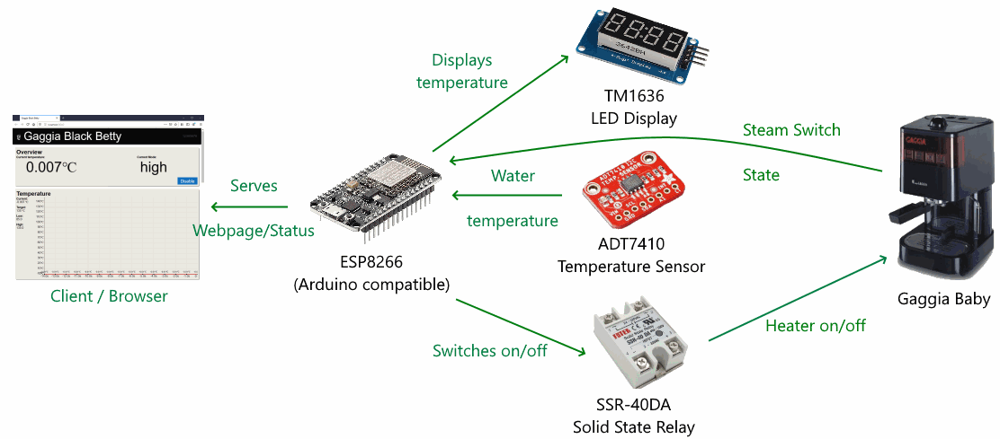

# black-betty

Project for controlling the heater plate of a coffee machine with an ESP8266 chip. The coffee machine can be controlled from a web interface (http only, local network) where the user can modify the target temperature and the PID settings.


Following components were used in this project:
- ADT7410 temperature sensor
    - Installed inside the coffee machine
    - Measures the temperature
- ESP8266 microcontroller (Arduino compatible)
    - Polls the temperature sensor
    - Uses a software PID for deciding when to heat
    - Toggles the solid state relay
    - Sends current temperature to display
    - Serves web requests
- TM1636
    - Displays the current temperature
    - Display the current relay state in the first digit dot
- SSR-40DA
    - Switches the 220V heater plate on/off
- Client Browser
    - Displays the current status
    - Allows changes to target temperature
    - Allows changes to PID kp/ki/kd variables

## Project setup
The Arduino project is in the **black_betty** folder. To compile this you need the following libraries installed in your Arduino IDE:
- ESP8266 Boards (Board manager, NodeMCU 1.0 (ESP-12E Module)
- PID (V1.2, Brett Beauregard) 
- TM1637 (V1.2, Avishay Orpaz)
- EasyADT7140 (V1.0, Geoffrey Van Landeghem)

After uploading the sketch the first time you need to open the serial monitor and execute the following commands (enter them in the textbox at the top):

```
set wifi <device-id> <ssid> <password>
```

If the password contains spaces you can quote the arguments. If the password contains quotes and spaces you have bad luck. This sets the wifi settings. The *device-id* will be the name of the ESP device in the local network.

To persist the settings you need to execute:

```
save
```

This will store the wifi settings in the EEPROM (**beware**: The ssid and password will be in plain text in the EEPROM).

To activate the new settings the ESP needs to be restarted. You can do this by entering:

```
restart
```

This will trigger a watchdog restart. The wifi will connect with the stored settings to the local network. Open a browser and enter `http://<device-id>` in the address bar. This will show the web frontend with the current status of the device.

## Web frontend
The web frontend was developed using npm, parcel and TypeScript. You need to install npm by yourself and then go to **black_betty_web** and call

```
npm install
```

This installs parcel and TypeScript. To start the development server use (press ctrl+C to end the server)

```
npm run serve
```

To update the webserver in the Arduino project you need to close the Arduino IDE (it has a strange behavoir with external modified files) and execute:

```
npm run export
```

This starts the production build of parcel and merges the files into a single page (including javascript/css) and puts it into the *webserver_index.cpp* file.
